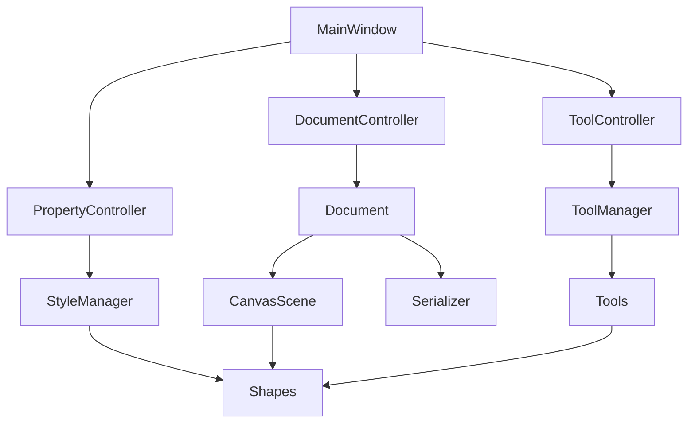

# 画图软件优化项目 - 架构设计文档

## 1. 概述

本文档描述画图软件优化项目的技术架构设计，包括模块划分、类设计、数据流和关键技术决策。

### 1.1 设计目标

- **可维护性**：清晰的模块职责，低耦合高内聚
- **可扩展性**：易于添加新工具、新图形类型
- **可测试性**：核心逻辑与 UI 分离，便于单元测试
- **性能**：优化关键路径，提升用户体验
- **健壮性**：完善的错误处理和日志系统

### 1.2 设计原则

1. **单一职责原则**：每个类只负责一个功能领域
2. **依赖倒置原则**：依赖抽象而非具体实现
3. **开闭原则**：对扩展开放，对修改关闭
4. **最小知识原则**：减少模块间的直接依赖

---

## 2. 整体架构

### 2.1 分层架构

```
┌─────────────────────────────────────────┐
│           UI Layer (ui/)                │
│  MainWindow, CanvasView, PropertyPanel  │
└─────────────────┬───────────────────────┘
                  │
┌─────────────────▼───────────────────────┐
│      Application Layer (app/)           │
│  Controllers, Managers, State Machines  │
└─────────────────┬───────────────────────┘
                  │
┌─────────────────▼───────────────────────┐
│        Domain Layer (core/)             │
│  Document, Shapes, Tools, Commands      │
└─────────────────┬───────────────────────┘
                  │
┌─────────────────▼───────────────────────┐
│     Infrastructure Layer (utils/)       │
│    Logging, Serialization, Validation   │
└─────────────────────────────────────────┘
```

### 2.2 核心模块关系



---

## 3. 核心模块设计

### 3.1 Document 模块 (core/document.py)

**职责**：管理文档的完整生命周期和状态


**类设计**：
```python
class Document:
    """文档管理类 - 管理场景数据和操作历史"""
    
    def __init__(self, scene: CanvasScene, undo_stack: QUndoStack):
        self._scene = scene
        self._undo_stack = undo_stack
        self._file_path: Optional[str] = None
        self._modified = False
        self._metadata = {}
    
    # 文档操作
    def new(self) -> None: ...
    def save(self, path: Optional[str] = None) -> bool: ...
    def load(self, path: str) -> bool: ...
    def export_png(self, path: str) -> bool: ...
    
    # 状态管理
    def is_modified(self) -> bool: ...
    def mark_modified(self) -> None: ...
    def get_file_path(self) -> Optional[str]: ...
    
    # 图形操作
    def add_shape(self, shape: QGraphicsItem) -> None: ...
    def remove_shape(self, shape: QGraphicsItem) -> None: ...
    def get_all_shapes(self) -> List[QGraphicsItem]: ...
```

**关键决策**：
- Document 作为场景数据的唯一入口，所有修改都通过它
- 集成 QUndoStack，自动管理撤销/重做
- 维护文档修改状态，支持"保存前提示"功能

---

### 3.2 Selection Manager (core/selection.py)

**职责**：统一管理选择状态和选择相关操作

**类设计**：
```python
class SelectionManager:
    """选择管理器 - 统一处理选择逻辑"""
    
    selectionChanged = Signal(list)  # 选择变化信号
    
    def __init__(self, scene: CanvasScene):
        self._scene = scene
        self._selected_items: List[QGraphicsItem] = []
        self._selection_mode = SelectionMode.REPLACE
    
    # 选择操作
    def select(self, items: List[QGraphicsItem], 
               mode: SelectionMode = SelectionMode.REPLACE) -> None: ...
    def select_all(self) -> None: ...
    def clear_selection(self) -> None: ...
    def toggle_selection(self, item: QGraphicsItem) -> None: ...
    
    # 查询
    def get_selected_items(self) -> List[QGraphicsItem]: ...
    def has_selection(self) -> bool: ...
    def get_selection_bounds(self) -> QRectF: ...
    
    # 选择反馈
    def update_selection_feedback(self) -> None: ...
```

**关键决策**：
- 使用信号机制通知选择变化，解耦 UI 更新
- 支持多种选择模式（替换、添加、切换）
- 统一管理选择反馈的显示和隐藏

---

### 3.3 Style Manager (core/styles.py)

**职责**：统一管理图形样式的应用和更新

**类设计**：
```python
class StyleManager:
    """样式管理器 - 统一样式应用逻辑"""
    
    def __init__(self):
        self._default_styles = {}
        self._style_cache = {}
    
    # 样式应用
    def apply_style(self, item: QGraphicsItem, style: Style) -> None: ...
    def apply_pen(self, item: QGraphicsItem, pen: QPen) -> None: ...
    def apply_brush(self, item: QGraphicsItem, brush: QBrush) -> None: ...
    
    # 样式获取
    def get_style(self, item: QGraphicsItem) -> Style: ...
    def get_default_style(self, shape_type: str) -> Style: ...
    
    # 批量操作
    def apply_style_to_selection(self, items: List[QGraphicsItem], 
                                  style: Style) -> None: ...
```

**数据模型**：
```python
@dataclass
class Style:
    """样式数据类"""
    pen_color: QColor = QColor("#000000")
    pen_width: float = 2.0
    pen_style: Qt.PenStyle = Qt.PenStyle.SolidLine
    brush_color: QColor = QColor("#00000000")
    opacity: float = 1.0
```

---

### 3.4 Tool Manager (app/tool_manager.py)

**职责**：管理工具的切换和状态

**类设计**：
```python
class ToolManager:
    """工具管理器"""
    
    toolChanged = Signal(str)
    
    def __init__(self, view: CanvasView):
        self._view = view
        self._current_tool: Optional[BaseTool] = None
        self._tools: Dict[str, BaseTool] = {}
        self._register_tools()
    
    def set_tool(self, tool_name: str) -> None: ...
    def get_current_tool(self) -> Optional[BaseTool]: ...
    def cancel_current_tool(self) -> None: ...
```

---

### 3.5 Property Controller (app/property_controller.py)

**职责**：处理属性面板和图形属性的交互

**类设计**：
```python
class PropertyController:
    """属性控制器 - 统一处理属性更新"""
    
    def __init__(self, panel: PropertyPanel, 
                 selection_mgr: SelectionManager,
                 style_mgr: StyleManager,
                 undo_stack: QUndoStack):
        self._panel = panel
        self._selection_mgr = selection_mgr
        self._style_mgr = style_mgr
        self._undo_stack = undo_stack
        self._connect_signals()
    
    # 属性更新（统一处理，避免重复代码）
    def update_pen_color(self, color: QColor) -> None: ...
    def update_pen_width(self, width: float) -> None: ...
    def update_brush_color(self, color: QColor) -> None: ...
    def update_opacity(self, opacity: float) -> None: ...
    
    # 面板刷新
    def refresh_panel(self) -> None: ...
```

**关键决策**：
- 使用模板方法模式统一属性更新流程
- 自动创建撤销命令，无需在每个方法中重复
- 支持批量更新选中的多个对象

---


## 4. 状态管理设计

### 4.1 视图状态机

**状态定义**：
```python
class ViewState(Enum):
    """视图状态枚举"""
    IDLE = "idle"              # 空闲（选择模式）
    DRAWING = "drawing"        # 正在绘制
    DRAGGING = "dragging"      # 正在拖动
    RUBBER_BAND = "rubber_band"  # 框选中
    PANNING = "panning"        # 平移中
    PASTE_PENDING = "paste_pending"  # 等待粘贴
```

**状态机设计**：
```python
class ViewStateMachine:
    """视图状态机"""
    
    stateChanged = Signal(ViewState, ViewState)  # (old, new)
    
    def __init__(self):
        self._current_state = ViewState.IDLE
        self._state_handlers = {}
        self._register_handlers()
    
    def transition_to(self, new_state: ViewState) -> bool:
        """状态转换"""
        if not self._can_transition(self._current_state, new_state):
            return False
        
        old_state = self._current_state
        self._exit_state(old_state)
        self._current_state = new_state
        self._enter_state(new_state)
        self.stateChanged.emit(old_state, new_state)
        return True
    
    def get_current_state(self) -> ViewState: ...
    def is_in_state(self, state: ViewState) -> bool: ...
```

**状态转换规则**：
```
IDLE ──────────────────────────────────────┐
  │                                         │
  ├─→ DRAWING (开始绘制)                    │
  ├─→ DRAGGING (拖动图形)                   │
  ├─→ RUBBER_BAND (框选)                    │
  ├─→ PANNING (空格+拖动)                   │
  └─→ PASTE_PENDING (Ctrl+V)               │
                                            │
所有状态 ──→ IDLE (操作完成/取消) ──────────┘
```

**关键决策**：
- 使用状态机统一管理，避免分散的布尔标志
- 状态转换时自动处理副作用（如禁用属性面板）
- 状态不一致时可自动恢复

---

## 5. 序列化优化设计

### 5.1 统一序列化接口

**接口定义**：
```python
class Serializable(Protocol):
    """可序列化接口"""
    
    def to_dict(self) -> Dict[str, Any]:
        """序列化为字典"""
        ...
    
    @classmethod
    def from_dict(cls, data: Dict[str, Any]) -> 'Serializable':
        """从字典反序列化"""
        ...
```

### 5.2 序列化器重构

**新设计**：
```python
class Serializer:
    """场景序列化器"""
    
    def __init__(self):
        self._type_registry: Dict[str, Type] = {}
        self._register_types()
    
    def register_type(self, type_name: str, cls: Type) -> None:
        """注册可序列化类型"""
        self._type_registry[type_name] = cls
    
    def serialize(self, scene: QGraphicsScene) -> Dict[str, Any]:
        """序列化场景"""
        shapes = []
        for item in scene.items():
            if isinstance(item, Serializable):
                data = item.to_dict()
                shapes.append(data)
        
        return {
            "version": "2.0",
            "shapes": shapes,
            "metadata": {}
        }
    
    def deserialize(self, data: Dict[str, Any], 
                    scene: QGraphicsScene) -> List[QGraphicsItem]:
        """反序列化场景"""
        version = data.get("version", "1.0")
        if version == "1.0":
            return self._deserialize_v1(data, scene)
        return self._deserialize_v2(data, scene)
```

**关键改进**：
1. 移除类名字符串匹配，统一使用 isinstance
2. 使用类型注册表，易于扩展
3. 支持版本迁移，保持向后兼容
4. 序列化前后保存/恢复选择状态

---

## 6. 性能优化设计

### 6.1 喷枪工具优化

**问题分析**：
- 当前每次移动绘制最多 300 个点
- 没有节流机制，快速移动时卡顿

**优化方案**：
```python
class OptimizedSprayTool(BrushTool):
    """优化的喷枪工具"""
    
    def __init__(self):
        super().__init__()
        self._last_spray_time = 0
        self._spray_interval = 16  # 约 60 FPS
        self._spray_buffer = []
    
    def on_move(self, scene, scene_pos, event):
        """节流的移动处理"""
        current_time = time.time() * 1000
        if current_time - self._last_spray_time < self._spray_interval:
            self._spray_buffer.append(scene_pos)
            return
        
        # 处理缓冲的点
        self._process_spray_buffer()
        self._last_spray_time = current_time
```

**性能目标**：
- 保持 60 FPS
- 减少样本数到 100-150
- 使用离屏缓冲优化

### 6.2 场景刷新优化

**当前问题**：
```python
scene.invalidate(scene.sceneRect())  # 刷新整个场景
```

**优化方案**：
```python
# 只刷新变化的区域
item.prepareGeometryChange()  # Qt 自动计算脏区域
item.update()  # 只刷新该项
```

**关键改进**：
- 移除全场景刷新调用
- 依赖 Qt 的脏区域机制
- 使用 ItemCoordinateCache 缓存

---

## 7. 日志系统设计

### 7.1 日志配置

**配置文件** (logging_config.py)：
```python
import logging
from logging.handlers import RotatingFileHandler

def setup_logging(level=logging.INFO):
    """配置日志系统"""
    
    # 根日志器
    logger = logging.getLogger('drawing_app')
    logger.setLevel(level)
    
    # 控制台处理器
    console_handler = logging.StreamHandler()
    console_handler.setLevel(logging.WARNING)
    console_formatter = logging.Formatter(
        '%(levelname)s: %(message)s'
    )
    console_handler.setFormatter(console_formatter)
    
    # 文件处理器
    file_handler = RotatingFileHandler(
        'drawing_app.log',
        maxBytes=10*1024*1024,  # 10MB
        backupCount=5
    )
    file_handler.setLevel(logging.DEBUG)
    file_formatter = logging.Formatter(
        '%(asctime)s - %(name)s - %(levelname)s - %(message)s'
    )
    file_handler.setFormatter(file_formatter)
    
    logger.addHandler(console_handler)
    logger.addHandler(file_handler)
    
    return logger
```

### 7.2 日志使用规范

```python
# 模块级日志器
logger = logging.getLogger('drawing_app.serializer')

# 使用示例
logger.debug("开始序列化场景，图形数量: %d", len(items))
logger.info("场景保存成功: %s", path)
logger.warning("图形类型未注册: %s", type_name)
logger.error("序列化失败: %s", str(e), exc_info=True)
```

---


## 8. 异常处理策略

### 8.1 异常分类

**业务异常**：
```python
class DrawingAppException(Exception):
    """应用基础异常"""
    pass

class SerializationError(DrawingAppException):
    """序列化错误"""
    pass

class FileOperationError(DrawingAppException):
    """文件操作错误"""
    pass

class ValidationError(DrawingAppException):
    """数据验证错误"""
    pass
```

### 8.2 异常处理模式

**统一错误处理装饰器**：
```python
def handle_errors(error_msg: str, show_dialog: bool = True):
    """统一错误处理装饰器"""
    def decorator(func):
        @wraps(func)
        def wrapper(*args, **kwargs):
            try:
                return func(*args, **kwargs)
            except DrawingAppException as e:
                logger.error(f"{error_msg}: {e}", exc_info=True)
                if show_dialog:
                    QMessageBox.critical(None, "错误", f"{error_msg}\n{e}")
                return None
            except Exception as e:
                logger.critical(f"未预期的错误: {e}", exc_info=True)
                if show_dialog:
                    QMessageBox.critical(None, "严重错误", 
                                       f"发生未预期的错误，请查看日志")
                return None
        return wrapper
    return decorator

# 使用示例
@handle_errors("保存文件失败")
def save_file(self, path: str) -> bool:
    # 实现
    ...
```

---

## 9. 测试策略

### 9.1 测试架构

```
tests/
├── unit/                    # 单元测试
│   ├── test_document.py
│   ├── test_serializer.py
│   ├── test_selection_manager.py
│   └── test_style_manager.py
├── integration/             # 集成测试
│   ├── test_save_load.py
│   └── test_tool_workflow.py
├── ui/                      # UI 测试
│   └── test_main_window.py
└── conftest.py             # pytest 配置
```

### 9.2 测试工具配置

**pytest 配置** (pytest.ini)：
```ini
[pytest]
testpaths = tests
python_files = test_*.py
python_classes = Test*
python_functions = test_*
addopts = 
    --verbose
    --cov=app
    --cov-report=html
    --cov-report=term-missing
```

### 9.3 关键测试用例

**序列化测试**：
```python
def test_save_and_load_preserves_all_properties():
    """测试保存和加载保持所有属性"""
    # 创建场景
    scene = create_test_scene()
    
    # 添加各种图形
    circle = CircleItem(100, 100, 50)
    circle.setPen(QPen(QColor("#FF0000"), 3.0))
    scene.addItem(circle)
    
    # 保存
    data = serializer.serialize(scene)
    
    # 加载到新场景
    new_scene = QGraphicsScene()
    serializer.deserialize(data, new_scene)
    
    # 验证
    items = new_scene.items()
    assert len(items) == 1
    loaded_circle = items[0]
    assert loaded_circle.pen().color() == QColor("#FF0000")
    assert loaded_circle.pen().widthF() == 3.0
```

---

## 10. 数据模型

### 10.1 核心数据结构

**场景数据模型**：
```python
@dataclass
class SceneData:
    """场景数据"""
    version: str = "2.0"
    shapes: List[Dict[str, Any]] = field(default_factory=list)
    metadata: Dict[str, Any] = field(default_factory=dict)
    canvas_size: Tuple[int, int] = (1200, 800)
```

**图形数据模型**：
```python
@dataclass
class ShapeData:
    """图形基础数据"""
    type: str
    id: str
    position: Tuple[float, float]
    style: Style
    z_index: int = 0
    visible: bool = True
    locked: bool = False
```

---

## 11. 迁移策略

### 11.1 向后兼容

**版本检测和迁移**：
```python
class VersionMigrator:
    """版本迁移器"""
    
    def migrate(self, data: Dict[str, Any]) -> Dict[str, Any]:
        """迁移到最新版本"""
        version = data.get("version", "1.0")
        
        if version == "1.0":
            data = self._migrate_v1_to_v2(data)
        
        return data
    
    def _migrate_v1_to_v2(self, data: Dict[str, Any]) -> Dict[str, Any]:
        """从 v1.0 迁移到 v2.0"""
        # 添加缺失的字段
        data["version"] = "2.0"
        data.setdefault("metadata", {})
        
        # 迁移图形数据
        for shape in data.get("shapes", []):
            if "id" not in shape:
                shape["id"] = str(uuid.uuid4())
        
        return data
```

### 11.2 渐进式重构

**重构步骤**：
1. **第一阶段**：添加新模块，不破坏现有代码
2. **第二阶段**：逐步迁移功能到新模块
3. **第三阶段**：移除旧代码，完成重构

**兼容性保证**：
- 保持现有 API 不变
- 使用适配器模式桥接新旧代码
- 充分测试确保功能一致

---

## 12. 关键技术决策

### 12.1 设计模式应用

| 模式 | 应用场景 | 收益 |
|------|---------|------|
| **命令模式** | 撤销/重做 | 已有，继续使用 |
| **策略模式** | 工具切换 | 已有，继续使用 |
| **状态模式** | 视图状态管理 | 新增，统一状态管理 |
| **观察者模式** | 事件通知 | 使用 Qt 信号槽 |
| **工厂模式** | 图形创建 | 新增，统一创建逻辑 |
| **单例模式** | 日志器、配置 | 新增，全局访问 |
| **适配器模式** | 新旧代码桥接 | 新增，平滑迁移 |

### 12.2 依赖注入

**使用依赖注入提升可测试性**：
```python
class MainWindow(QMainWindow):
    def __init__(self, 
                 document: Optional[Document] = None,
                 tool_manager: Optional[ToolManager] = None,
                 selection_manager: Optional[SelectionManager] = None):
        super().__init__()
        
        # 依赖注入，便于测试
        self.document = document or Document(...)
        self.tool_manager = tool_manager or ToolManager(...)
        self.selection_manager = selection_manager or SelectionManager(...)
```

### 12.3 配置管理

**配置文件** (config.py)：
```python
@dataclass
class AppConfig:
    """应用配置"""
    # 性能配置
    max_undo_steps: int = 100
    cache_enabled: bool = True
    
    # UI 配置
    theme: str = "light_teal.xml"
    auto_save_interval: int = 300  # 秒
    
    # 日志配置
    log_level: str = "INFO"
    log_to_file: bool = True
    
    @classmethod
    def load(cls, path: str = "config.json") -> 'AppConfig':
        """从文件加载配置"""
        ...
```

---

## 13. 性能基准

### 13.1 性能指标

| 操作 | 当前性能 | 目标性能 | 测量方法 |
|------|---------|---------|---------|
| 启动时间 | ~3s | <2s | 从启动到窗口显示 |
| 工具切换 | ~150ms | <100ms | 点击到光标变化 |
| 保存 100 图形 | ~2s | <1s | 序列化+写文件 |
| 加载 100 图形 | ~2.5s | <1s | 读文件+反序列化 |
| 喷枪绘制 | ~20 FPS | >30 FPS | 快速移动时帧率 |

### 13.2 性能测试

```python
def benchmark_serialization():
    """序列化性能基准测试"""
    scene = create_scene_with_n_shapes(100)
    
    start = time.time()
    data = serializer.serialize(scene)
    serialize_time = time.time() - start
    
    start = time.time()
    new_scene = QGraphicsScene()
    serializer.deserialize(data, new_scene)
    deserialize_time = time.time() - start
    
    assert serialize_time < 0.5, f"序列化太慢: {serialize_time}s"
    assert deserialize_time < 0.5, f"反序列化太慢: {deserialize_time}s"
```

---

## 14. 实施计划

### 14.1 阶段划分

**Phase 1: 基础设施 (P0)**
- 日志系统
- 异常处理框架
- 测试框架搭建

**Phase 2: 核心模块 (P0-P1)**
- Document 模块
- SelectionManager
- StyleManager
- 序列化重构

**Phase 3: 架构重构 (P1)**
- PropertyController
- ToolManager
- ViewStateMachine
- MainWindow 瘦身

**Phase 4: 性能优化 (P2)**
- 喷枪优化
- 场景刷新优化
- 缓存策略

**Phase 5: 完善和测试 (P2)**
- 补充测试用例
- 文档完善
- 性能基准测试

### 14.2 风险缓解

| 风险 | 缓解措施 |
|------|---------|
| 重构引入 bug | 每个模块都有单元测试 |
| 性能回退 | 建立性能基准，持续监控 |
| 兼容性问题 | 版本迁移器，充分测试 |
| 进度延期 | 按优先级分阶段，核心功能优先 |

---

## 15. 成功标准

### 15.1 技术指标

- ✅ 代码覆盖率 ≥ 60%
- ✅ 所有性能基准达标
- ✅ 无 P0/P1 级别的已知 bug
- ✅ 代码符合 PEP 8 规范
- ✅ 所有公共 API 有文档字符串

### 15.2 质量指标

- ✅ MainWindow 代码行数 < 300
- ✅ 平均函数复杂度 < 10
- ✅ 模块耦合度低（依赖注入）
- ✅ 无循环依赖

### 15.3 用户体验指标

- ✅ 选择反馈清晰可见
- ✅ 工具切换流畅
- ✅ 保存/加载可靠
- ✅ 错误提示友好

---

## 16. 总结

本设计文档提供了画图软件优化的完整技术方案，包括：

1. **清晰的分层架构**：UI、应用、领域、基础设施四层
2. **核心模块设计**：Document、SelectionManager、StyleManager 等
3. **状态管理方案**：使用状态机统一管理视图状态
4. **性能优化策略**：喷枪节流、场景刷新优化
5. **质量保障体系**：日志、异常处理、测试框架

通过实施本设计，预期达到：
- 代码质量：2/5 → 4/5
- 架构设计：3/5 → 4/5
- 用户体验：3/5 → 4/5
- 测试覆盖：0% → 60%+

设计遵循 SOLID 原则，注重可维护性、可扩展性和可测试性，为项目的长期发展奠定坚实基础。
