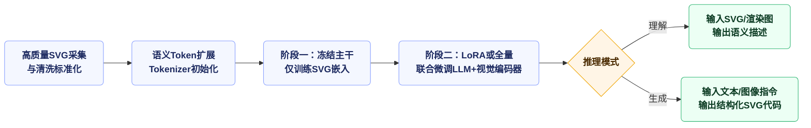

# Empowering LLMs to Understand and Generate Complex Vector Graphics: LLM4SVG 阅读报告

  【梁力航】
  【23336128】

## 研究背景

在阅读《Empowering LLMs to Understand and Generate Complex Vector Graphics》后，我尝试先回溯整个研究所面对的时代背景与问题。计算机图形学正从以往的点阵图像生成迅速迈向矢量内容的智能化合成。SVG凭借可缩放、易编辑、结构化、语义清晰等特点，早已成为UI、图标、数据可视化乃至设计流程的基础表达方式。然而，当前深度学习方法在处理SVG时呈现出显著的局限：一类方法依赖优化策略，往往借助CLIP等模型在像素到矢量之间迭代逼近，效率低且难以得到可编辑的结构结果；另一类面向矢量的神经网络，以RNN、VAE或Transformer为主，受限于数据规模和语义模糊，通常只能处理有限的路径命令或简单字体图标。与此同时，LLM虽然具备理解XML和自然语言的潜质，但由于网络上SVG往往嵌套在网页代码里，语义表示易混淆，生成过程中常常出现路径顺序错乱、属性编码不精确、遮挡逻辑失衡等问题。更大的挑战在数据层面——大规模、高质量、带指令的矢量数据稀缺，导致模型无法在结构化语义和渲染细节之间建立可靠映射。LLM4SVG正是针对这些瓶颈提出的一套系统性解决策略，旨在让语言模型真正理解并生成复杂的矢量图形。

An Overview of LLM4SVG

该图展示了LLM4SVG的整体架构设计，包括SVG语义标记、模型架构以及训练和推理流程。通过引入语义标记和专门的训练策略，使得LLM能够更好地理解和生成SVG图形。

## 主要贡献

论文的主要贡献可以概括为以下三点：

首先，提出了LLM4SVG框架，这是首个支持任意LLM或多模态LLM处理SVG任务的框架。该框架通过可学习的语义Token机制，使模型在理解和生成阶段都能保持对几何、外观与语言的精确对齐，从而弥合自然语言处理与矢量图形之间的差距，使输出结果符合人类设计原则。

其次，设计了模块化架构，在指令和参数层面实现解耦。通过集成语义标签、矢量指令编码器、微调命令和强大的LLM，将几何、外观和语言信息紧密结合，实现了对SVG元素的全面理解，产生语义一致的矢量图形。

最后，开发了SVGX-SFT数据集。该数据集包含由人类设计师创作的高质量SVG以及为LLM训练特别制作的58万条指令跟随数据。这一数据集支持论文采用的训练策略，增强了模型在SVG生成方面的性能，并为未来的矢量图形研究奠定了基础。

## 技术路线

在技术路线方面，LLM4SVG采用了"两阶段训练 + 语义注入"的策略。研究者首先在Tokenizer中加入55个SVG语义Token，涵盖标签、属性和路径指令，并通过语义描述初始化嵌入权重，使这些Token从一开始就具备几何意义。接着，他们在预训练阶段固定LLM主体与视觉编码模块，只更新新增Token的嵌入，让模型先完成对矢量语法的对齐；在第二阶段的监督微调中，再视算力选择LoRA/QLoRA或全量微调，对LLM、视觉编码器和语义模块联合训练。数据构建上，他们先人工收集复杂多彩的矢量作品，统一画布、坐标和结构；再借助BLIP生成初步描述，使用GPT-4扩展成多轮指令对话，并设计涉及文本生成、图文联合、SVG解析等五种模板，确保模型在不同场景下都能获得一致的语义序列。训练过程中还允许加入渲染图像作为条件信息，用以指导理解或生成阶段的语义对齐。推理时，对于理解任务，模型输入SVG代码或对应图像，输出细致描述；对于生成任务，则根据文本或多模态提示直接生成完整的SVG序列。

Overview of SVGX-SFT Dataset

该图展示了SVGX-SFT数据集的构成情况，包含了从高质量SVG收集到多轮指令对话生成的完整数据构建流程。该数据集为模型的监督微调提供了坚实的基础。

为了更清晰刻画算法，按照论文与重构的伪代码，核心公式与流程可总结为：

- **语义标记初始化**：对每个SVG语义标记 $s$，其嵌入向量用描述文本的平均语义初始化

$$
E(s) = \frac{1}{n}\sum_{j=1}^{n} W_{\text{emb}} \, w_j
$$

其中 $W_{\text{emb}}$ 为嵌入层参数，$w_j$ 是描述标记的子词表示。这让模型在词表层面具备几何/属性语义。

- **生成/理解的条件概率目标**：长度为 $L$ 的目标序列 $X_a$ 的生成概率写作

$$
p(X_a \mid X_v, X_{\text{inst}}) = \prod_{i=1}^{L} p_{\varepsilon}\!\left(x_i \mid X_v, X_{\text{inst}}, X_a, \hat{x}_{i-1}\right)
$$

其中 $X_v$ 是SVG或其渲染、$X_{\text{inst}}$ 为指令，$\hat{x}_{i-1}$ 为已生成前缀，$\varepsilon$ 是可训练参数。

- **两阶段训练落地**：
  1) 冻结主干LLM与视觉编码器，仅训练新增SVG嵌入 $W_{\text{emb}}$，完成语义对齐。
  2) 端到端微调，可选LoRA或全量，联合优化嵌入、LLM及视觉编码器，使生成/理解同时收敛。

## 创新点

创新点主要体现在三个维度。首先是语义Token体系：研究者没有沿用传统Tokenizer把<path>、fill、stroke等元素拆成普通文字，而是让它们对应独立Token，并通过语义描述向量初始化Embedding，使模型从嵌入层开始就区分SVG语法与自然语言。这种做法极大降低了语义歧义，提升了模型在数值坐标、颜色编码等连续属性上的精度。其次是模块化架构配合两阶段训练，既保留了大模型原生的语言理解能力，又通过专门的矢量指令编码与视觉条件输入，确保几何信息与语言描述同步优化。第三个创新在于数据构建策略：通过自动化清洗、重组以及基于GPT的高质量指令扩写，形成了覆盖生成与理解的多类型对话模板，保证模型在多轮交互中输出的Token顺序、语义约束和坐标精度都可控。与现有LLM直接把SVG视作普通文本不同，LLM4SVG在编码、训练、解码各环节都具备针对矢量结构的定制机制。

## 应用场景

应用场景方面，LLM4SVG的示例和实验显示，它能在UI图标、按钮、Logo、矢量插画、简易数据可视化等领域提供更精准且可编辑的输出。由于模型支持十六进制颜色和小数坐标，生成的SVG即插即用、无需再做复杂清理，对于需要快速迭代图形素材的设计团队尤其重要。结合渲染图像条件输入，模型还能胜任"以图搜矢量"的理解任务，让设计者在自然语言层面查询、修改或解释现有SVG结构。此外，超越传统的"文字到图像再到矢量"流程，LLM4SVG直接在矢量空间生成内容，大幅缩短设计流程，也为互动式矢量编辑、智能设计助手、跨模态创意工具奠定了基础。当然，目前模型主要聚焦UI和图标类图形，未来若扩展到复杂插画、工程图、数据可视化等领域，还需在语义多样性和几何精度上继续增强。

LLM4SVG can understand and generate vector graphics from textual description

该图展示了LLM4SVG在理解和生成任务上的具体示例。模型可以根据文本描述生成对应的SVG图形，也可以对给定的SVG图形进行语义理解和描述，体现了模型双向处理能力。

## 实验与评估

在更细致的实验分析里，作者不仅按照优化式、神经网络、LLM三大类方法逐一比较，还考察了不同基座LLM（如GPT-2系列、Phi-2、Falcon、LLaVA）作为骨架时的表现差异。我们能从表格中看到，Tokenizer对于数字处理的粒度极大影响最终坐标的连续性：Qwen一类把数字整体打包的模型在坐标预测时常常"卡顿"，而GPT-2那种显式收录0-1000整数的词表则在语义和几何之间建立了更稳定的桥梁。实验也揭示了一个常被忽视的细节——十六进制颜色和小数坐标的生成不仅需要语义Token，更依赖LLM自带的数值表示能力，因此选择合适的基座模型与定制词表同样重要。

我尤其关注他们在人类评价和Pick Score实验中的安排。研究者把Claude 3.5、GPT-4、LLM4SVG以及人工样本打乱呈现，只给评审者文本提示，让大家从提示一致性、视觉质量、使用意愿三个维度做打分。结果显示LLM4SVG的Prompt Alignment和Visual Quality都远高于两大闭源模型，使用意愿更是逼近人工作品，这在一定程度上证明了"语义Token+指令模板+数据清洗"联动策略的价值。虽然这类主观评价的样本数量有限，但它向我们传递了一个积极信号：LLM若能在"结构清洁"和"语义贴合"上做到位，就有机会在设计场景里获得真实用户的认可。

Qualitative comparison of LLM4SVG with state-of-the-art SVG generation methods

该图展示了LLM4SVG与其他先进SVG生成方法的定性对比结果。可以看出，LLM4SVG在图形质量和语义准确性方面均优于其他方法，特别是在复杂图形的生成上表现突出。

## 个人思考

在个人思考部分，我对这项工作最深的感受是：它让LLM在矢量图形领域真正"进了门"。过去不少尝试要么停留在把SVG当文本预测，要么依赖优化方法反复迭代，距离设计实践仍有鸿沟。LLM4SVG通过在词汇、数据和训练流程上做系统设计，证明LLM可以具备矢量语法意识和几何精度，在多项指标上逼近甚至超过传统方法。尤其是他们对Tokenizer的改造与数据模板的设计，让模型生成的内容不再模糊笼统，而是语义清晰、结构完备。即便如此，我认为还有几方面值得进一步探索。其一，SVGX-SFT主要面向UI元素，后续可引入更多风格、艺术形式和数据图形，避免模型在视觉风格上过度集中。其二，模型虽然支持多轮指令，但尚未实现真正的交互式编辑，如通过自然语言指定"把第三个圆角矩形的边框改为渐变"这类细粒度指令。其三，评估指标仍以FID、CLIP Score等为主，SVG特有的层级、拓扑、可编辑性还缺乏成熟量化标准，未来或许需要结合人机协同或专业设计师评价，建立更贴近工业需求的测试集。最后，在实际落地中，矢量生成常与版权、风格一致性、可访问性等因素交织，对模型的伦理约束和安全策略也需要同步考量。

## 总结

综合来看，LLM4SVG提供了一条可行路径，把语言大模型带入矢量图形的理解与生成。论文用大量实验展示了与优化方法、传统神经网络以及其它LLM的对比优势，也揭示了Tokenizer设计、语义Token初始化、指令模板构建的关键作用。对计算机图形学的作业来说，这项研究不仅是技术突破，更是一次系统工程：把数据清洗、语义建模、模型训练、评估与人类偏好调查串联起来，构成完整的闭环。它展示了在多模态时代，把LLM的语言能力与矢量几何知识融合的可能性，也提示我们未来的设计工具将更具交互性与智能化。当人们可以用自然语言直接描述、修改和理解SVG时，创意流程与生产效率都将被重新定义。

## 参考文献

1. Ximing Xing, Juncheng Hu, Guotao Liang, Jing Zhang, Dong Xu, Qian Yu*. Empowering LLMs to Understand and Generate Complex Vector Graphics. CVPR 2025.

2. Alec Radford, Jong Wook Kim, Chris Hallacy, et al. **Learning transferable visual models from natural language supervision**[C]. ICML, 2021: 8748-8763.

3. Haotian Liu, Chunyuan Li, Qingyang Wu, Yong Jae Lee. **Visual instruction tuning**[C]. NeurIPS, 2023: 34892-34916.

4. Ximing Xing, Chuang Wang, Haitao Zhou, Jing Zhang, Qian Yu, Dong Xu. **Diffsketcher: Text guided vector sketch synthesis through latent diffusion models**[C]. NeurIPS, 2023.

5. Ajay Jain, Amber Xie, Pieter Abbeel. **Vectorfusion: Text-to-svg by abstracting pixel-based diffusion models**[C]. CVPR, 2023.

6. Mark Chen, Jerry Tworek, Heewoo Jun, et al. **Evaluating large language models trained on code**[J]. arXiv preprint arXiv:2107.03374, 2021.

7. Tim Dettmers, Artidoro Pagnoni, Ari Holtzman, Luke Zettlemoyer. **Qlora: Efficient finetuning of quantized llms**[C]. NeurIPS, 2024.

8. Long Ouyang, Jeffrey Wu, Xu Jiang, et al. **Training language models to follow instructions with human feedback**[C]. NeurIPS, 2022: 27730-27744.

